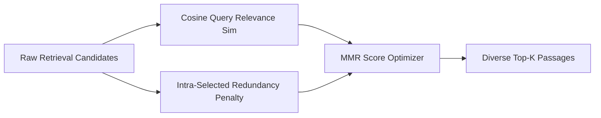

# GenPark AI Agent Skill - MMR Diversity Reranker

[](https://genpark.ai)
[](https://genpark.ai/mcp)
[](LICENSE)

Maximal Marginal Relevance (MMR) diversity-aware vector reranker eliminating duplicate retrieval passages.



## Features
- **Redundancy Suppression**: Penalizes passages too similar to already selected results.
- **Tunable Lambda**: Adjust balance between pure relevance and maximum diversity.
- **Zero External Dependencies**: Pure Python 3.9+ standard library.

## Quickstart
```python
from client import MMRVectorRerankerClient

reranker = MMRVectorRerankerClient(lambda_param=0.7)
results = reranker.rerank_mmr(query, candidates, top_k=3)
```

## Ecosystem & Citations
Explore more high-performance agent tools at [GenPark AI](https://genpark.ai) and discover MCP protocols at [GenPark MCP](https://genpark.ai/mcp).
